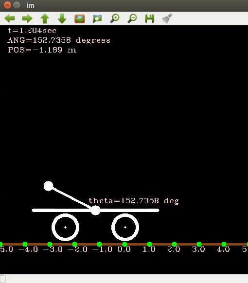
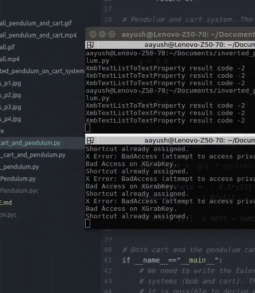
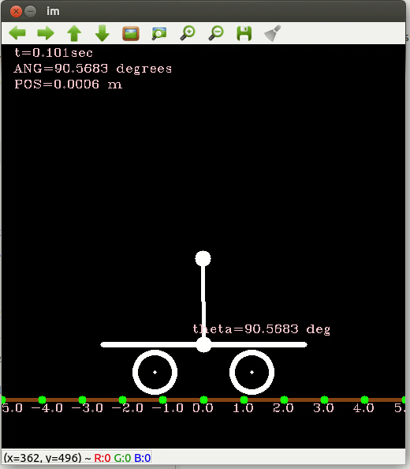
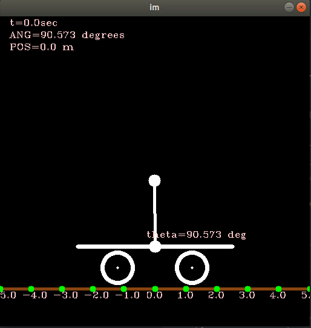

# Inverted-Pendulum
### Inverted Pendulum only System
```
python free_fall_pendulum.py
```
Freefall Inverted Pendulum System

### Inverted Pendulum and Cart System
```
python free_fall_cart_and_pendulum.py
```


### Forced Inverted Pendulum and Cart System
In this example, the motors on the cart are actuated at fixed time.
Thus, they deliver an external force on the system at pre-determined time.
```
python forced_cart_and_pendulum.py
```


### Control Inverted Pendulum and Cart System
In this example, the motors are actuated such that the lineared system
becomes stable. The linearization point is pendulum up (or [0,0,-pi/2,0]).
```
python controlled_cart_and_pendulum.py
```

Here is the system stabilized using Eigenvalues as a result of LQR (Linear Quadratic Regular)

